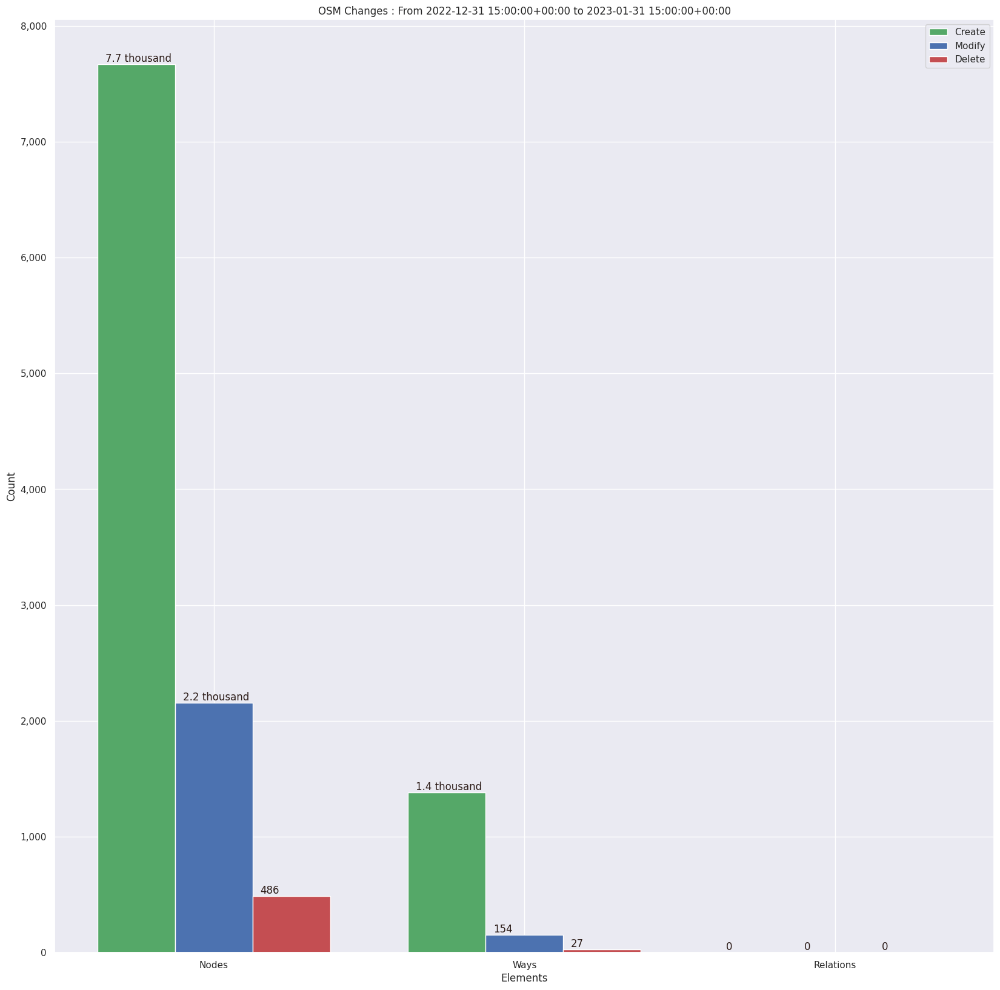
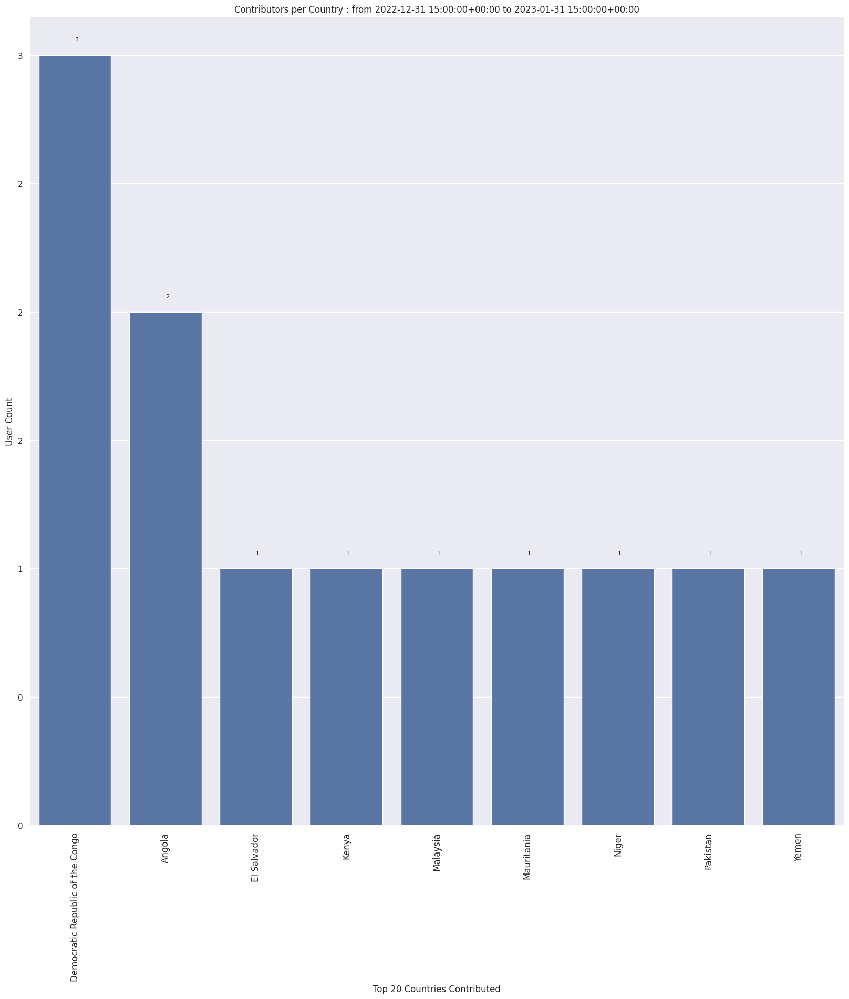
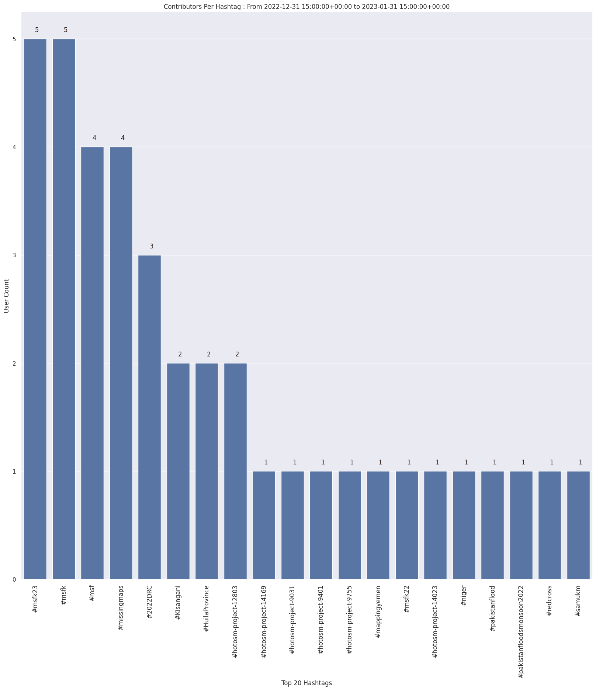
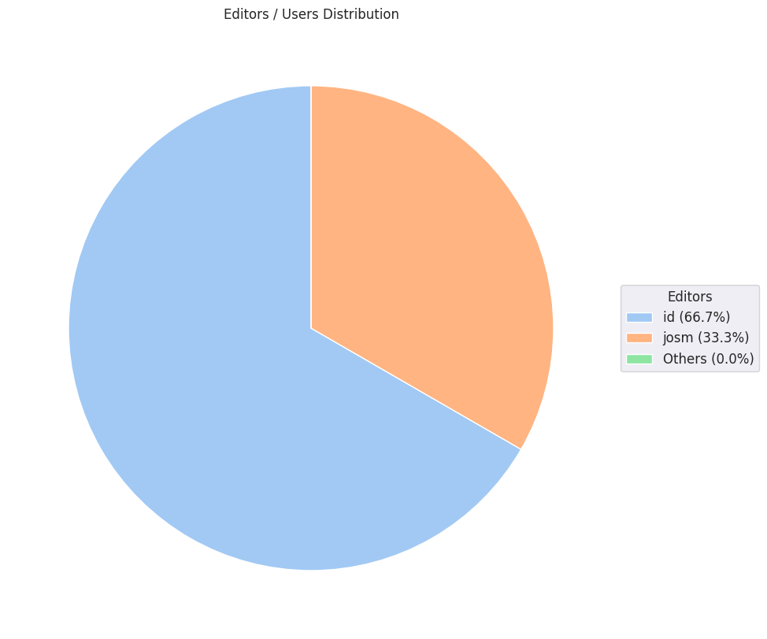

### Last Update : Stats from 2022-12-31 15:00:00+00:00 to 2023-01-31 15:00:00+00:00 (UTC Timezone)

#### 5 Users made 99 changesets with 11.9 thousand map changes.
#### 9.1 thousand OSM Elements were Created, 2.3 thousand Modified & 513 Deleted.
Get Full Stats at [stats.csv](/msfk/2023/1/stats.csv)
 & Get Summary Stats at [stats_summary.csv](/msfk/2023/1/stats_summary.csv)

Top 5 Users are : 
- Deuckchung : 5.4 thousand Map Changes
- 김진경 : 2.9 thousand Map Changes
- Ireneeom : 2.5 thousand Map Changes
- iankim23 : 962 Map Changes

Summary of Supplied Tags
- poi = Created: 0, Modified : 0
- building = Created: 1.4 thousand, Modified : 108
- highway = Created: 9, Modified : 33

Top 5 trending hashtags are:
- #msfk : 5 users
- #msfk23 : 5 users
- #msf : 4 users
- #missingmaps : 4 users
- #2022DRC : 3 users

Top 5 trending editors are:
- iD 2.21.1 : 4 users
- JOSM/1.5 (18622 en) : 1 users
- JOSM/1.5 (18621 en) : 1 users

Top 5 trending Countries where user contributed are:
- Democratic Republic of the Congo : 3 users
- Angola : 2 users
- Mauritania : 1 users
- Pakistan : 1 users
- Yemen : 1 users

 Charts : 
 
 
 
 
