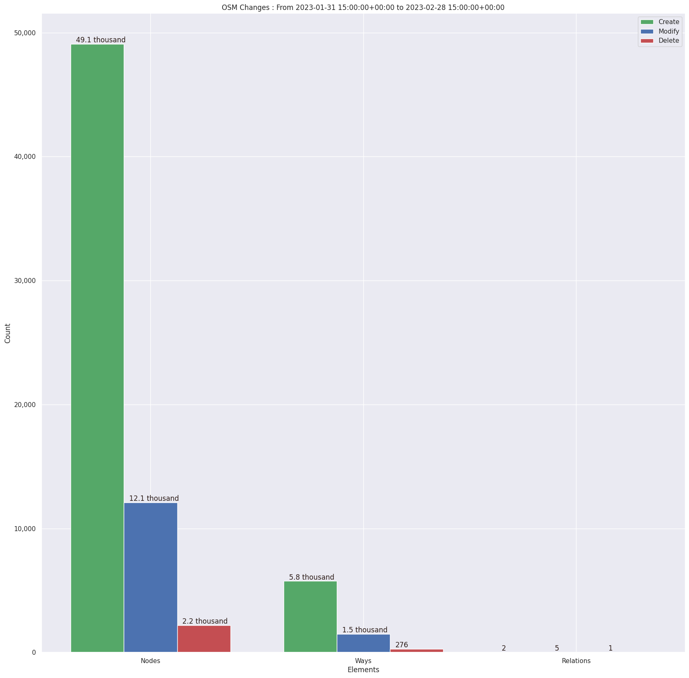
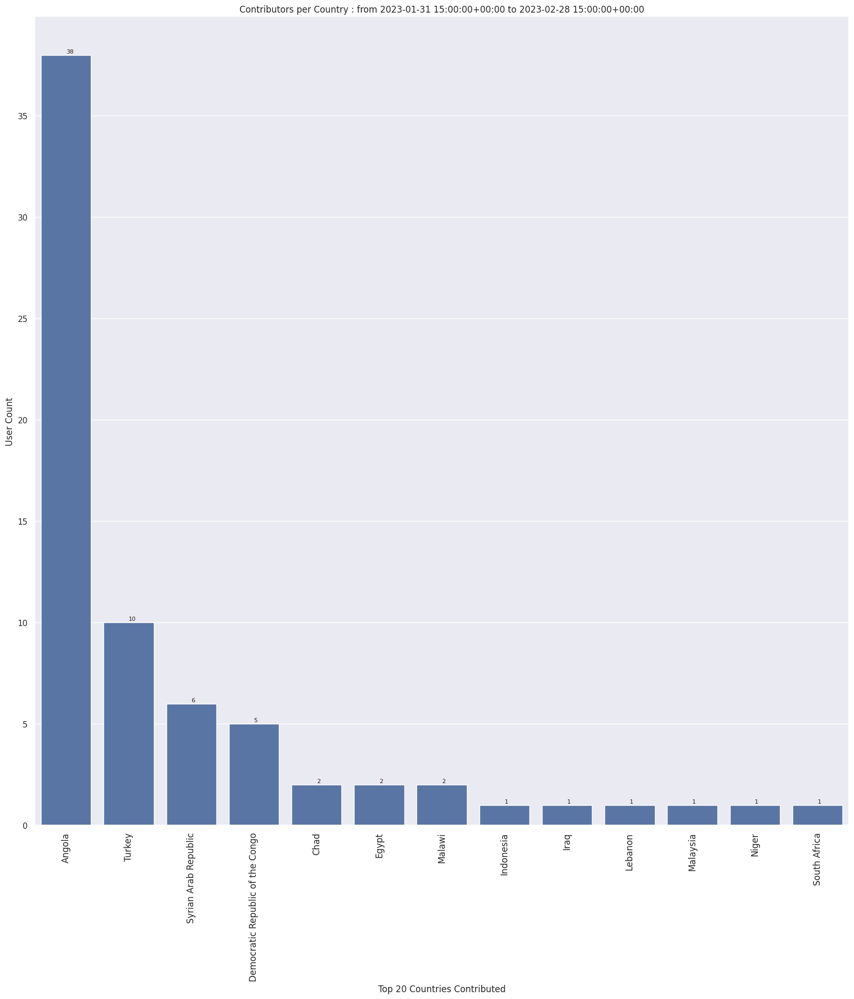
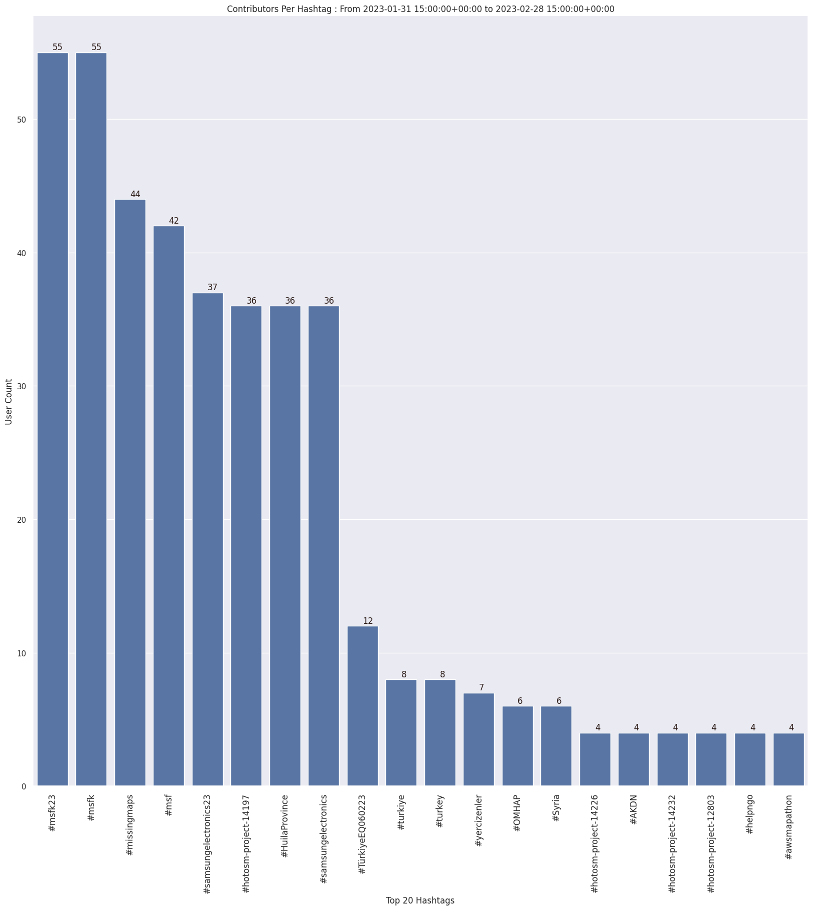
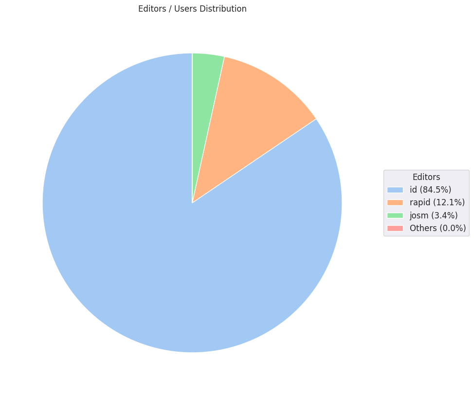

### Last Update : Stats from 2023-01-31 15:00:00+00:00 to 2023-02-28 15:00:00+00:00 (UTC Timezone)

#### 56 Users made 490 changesets with 70.9 thousand map changes.
#### 54.9 thousand OSM Elements were Created, 13.6 thousand Modified & 2.4 thousand Deleted.
Get Full Stats at [stats.csv](/msfk/2023/2/stats.csv)
 & Get Summary Stats at [stats_summary.csv](/msfk/2023/2/stats_summary.csv)

Top 5 Users are : 
- LuxuryCoop : 15.0 thousand Map Changes
- upscope : 8.6 thousand Map Changes
- Palan Lee : 4.7 thousand Map Changes
- Choe Gwanghyeon : 4.3 thousand Map Changes
- MintLatte : 4.2 thousand Map Changes

Summary of Supplied Tags
- poi = Created: 6, Modified : 38
- building = Created: 5.1 thousand, Modified : 873
- highway = Created: 571, Modified : 547

Top 5 trending hashtags are:
- #msfk23 : 55 users
- #msfk : 55 users
- #missingmaps : 44 users
- #msf : 42 users
- #samsungelectronics23 : 37 users

Top 5 trending editors are:
- iD 2.21.1 : 49 users
- RapiD 1.1.9-tm.1 : 7 users
- JOSM/1.5 (18646 ko) : 1 users
- JOSM/1.5 (18646 en) : 1 users

Top 5 trending Countries where user contributed are:
- Angola : 38 users
- Turkey : 10 users
- Syrian Arab Republic : 6 users
- Democratic Republic of the Congo : 5 users
- Chad : 2 users

 Charts : 
 
 
 
 
