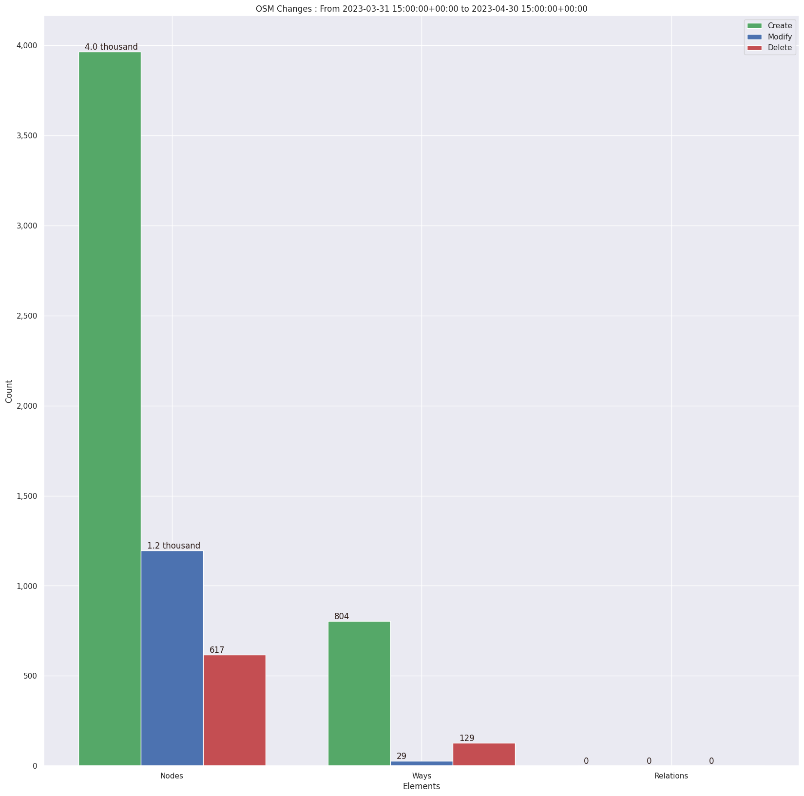
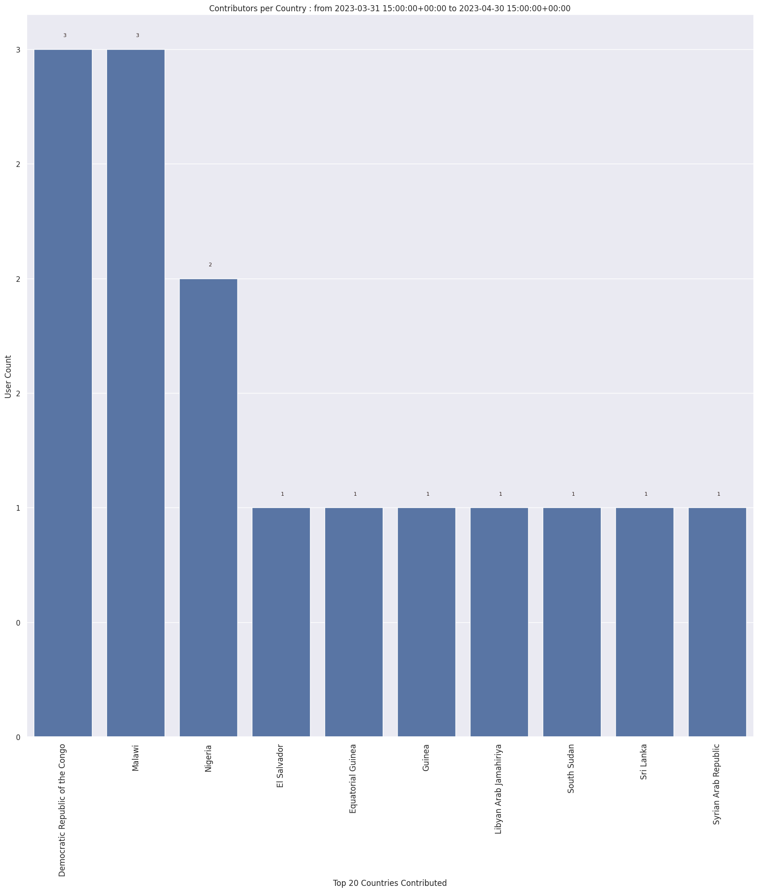
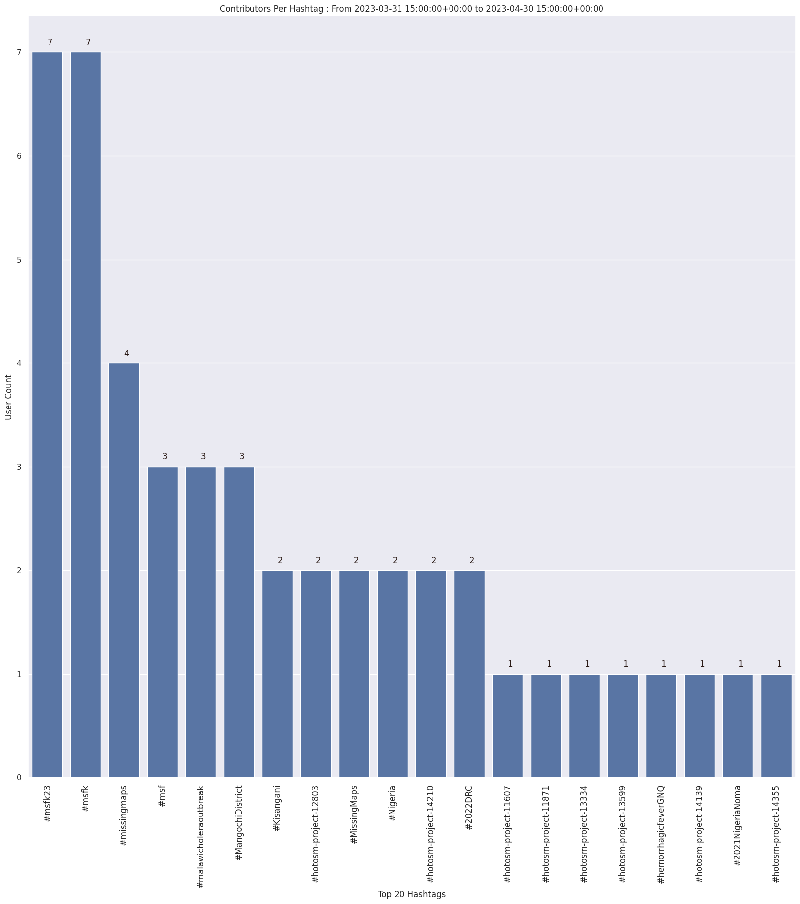
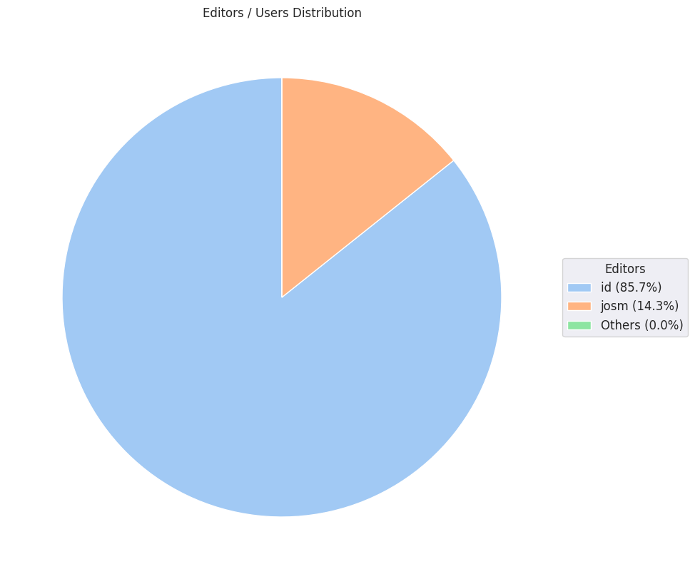

### Last Update : Stats from 2023-03-31 15:00:00+00:00 to 2023-04-30 15:00:00+00:00 (UTC Timezone)

#### 7 Users made 74 changesets with 6.7 thousand map changes.
#### 4.8 thousand OSM Elements were Created, 1.2 thousand Modified & 746 Deleted.
Get Full Stats at [stats.csv](/msfk/2023/4/stats.csv)
 & Get Summary Stats at [stats_summary.csv](/msfk/2023/4/stats_summary.csv)

Top 5 Users are : 
- Doyeon Kim 12 : 3.7 thousand Map Changes
- baejiye : 996 Map Changes
- MarigoldC : 831 Map Changes
- happypypy : 459 Map Changes
- HyeinHong : 398 Map Changes

Summary of Supplied Tags
- poi = Created: 0, Modified : 0
- building = Created: 766, Modified : 19
- highway = Created: 1, Modified : 6

Top 5 trending hashtags are:
- #msfk23 : 7 users
- #msfk : 7 users
- #missingmaps : 4 users
- #msf : 3 users
- #malawicholeraoutbreak : 3 users

Top 5 trending editors are:
- iD 2.21.1 : 6 users
- JOSM/1.5 (18700 en) : 1 users

Top 5 trending Countries where user contributed are:
- Malawi : 3 users
- Democratic Republic of the Congo : 3 users
- Nigeria : 2 users
- Equatorial Guinea : 1 users
- Sri Lanka : 1 users

 Charts : 
 
 
 
 
