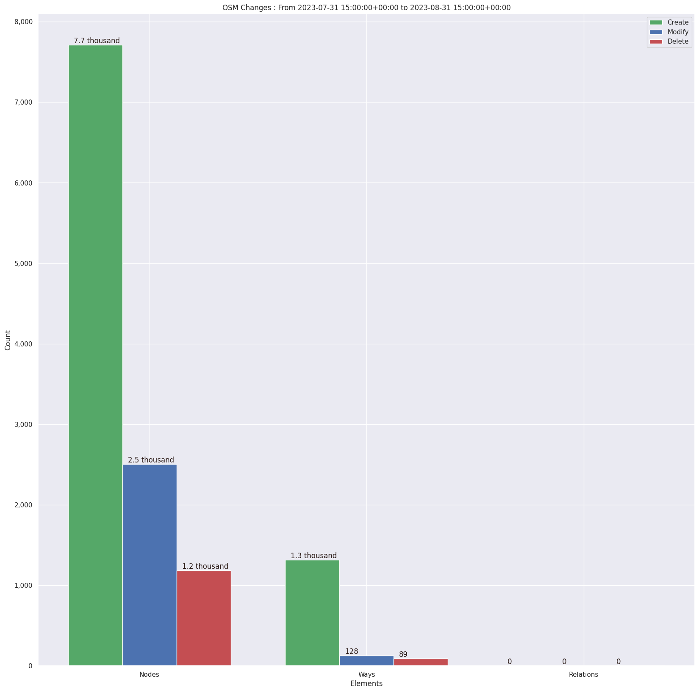
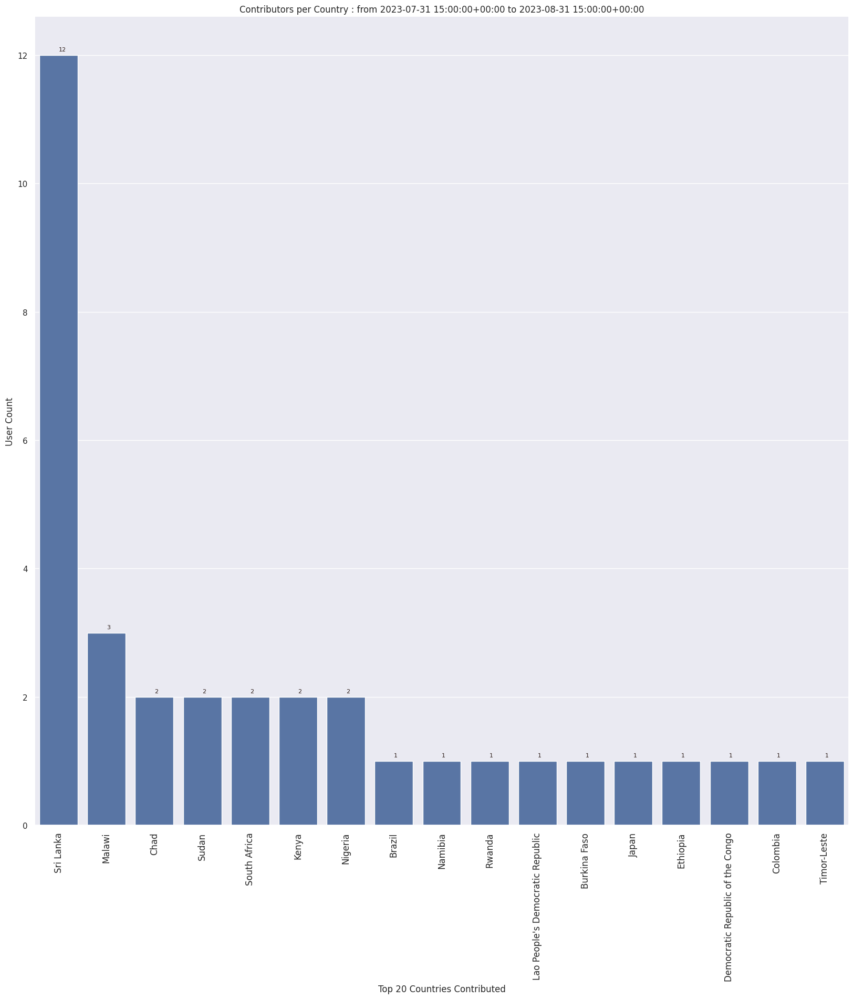
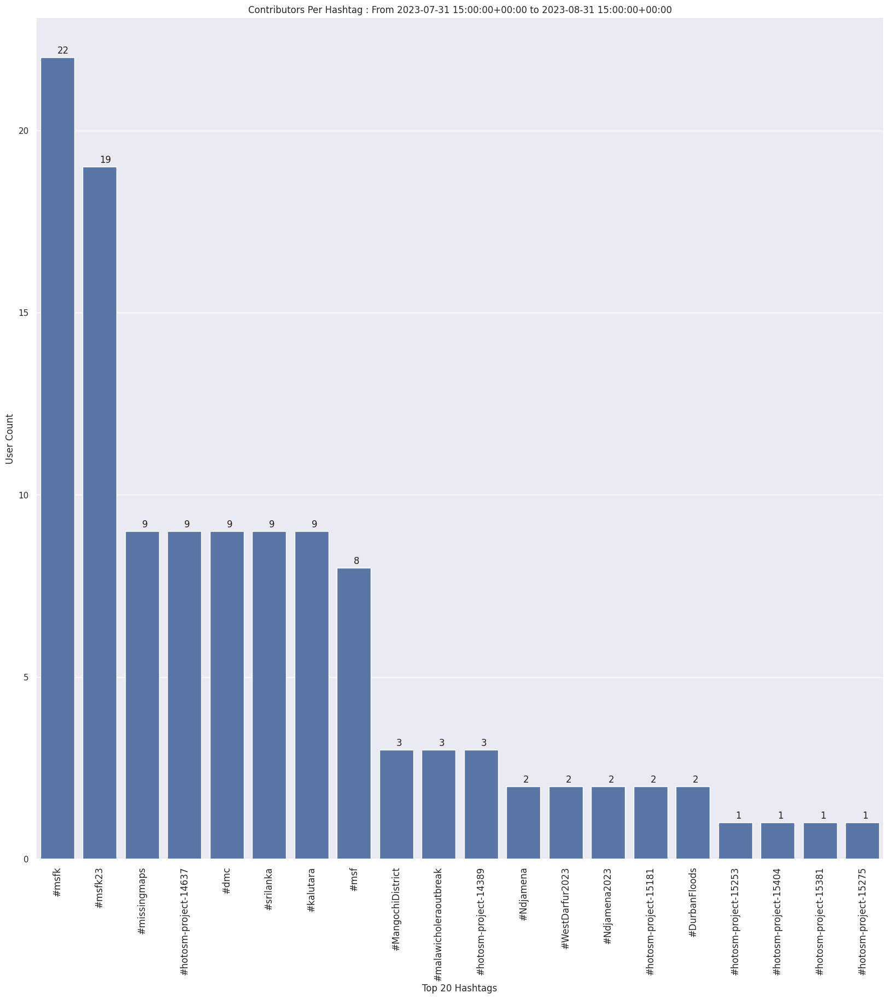
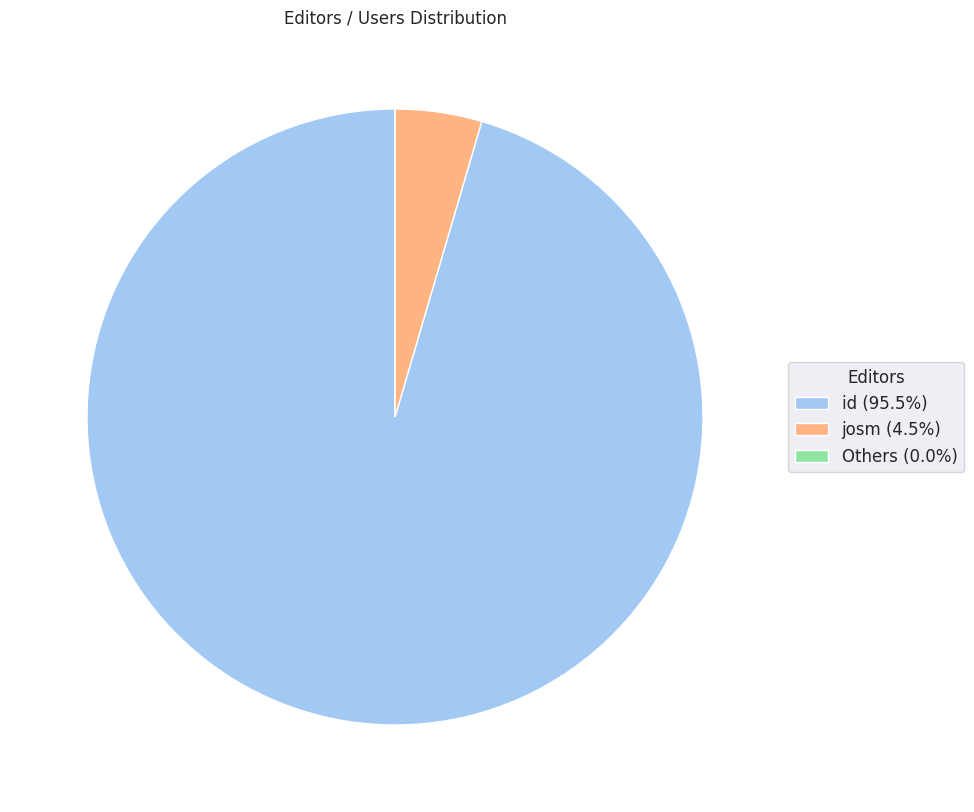

### Last Update : Stats from 2023-07-31 15:00:00+00:00 to 2023-08-31 15:00:00+00:00 (UTC Timezone)

#### 22 Users made 155 changesets with 12.9 thousand map changes.
#### 9.0 thousand OSM Elements were Created, 2.6 thousand Modified & 1.3 thousand Deleted.
Get Full Stats at [stats.csv](/msfk/2023/8/stats.csv)
 & Get Summary Stats at [stats_summary.csv](/msfk/2023/8/stats_summary.csv)

Top 5 Users are : 
- timeontheroad : 2.1 thousand Map Changes
- Choe Gwanghyeon : 2.0 thousand Map Changes
- Deuckchung : 2.0 thousand Map Changes
- sunju park : 1.1 thousand Map Changes
- baejiye : 1.1 thousand Map Changes

Summary of Supplied Tags
- poi = Created: 0, Modified : 2
- building = Created: 1.2 thousand, Modified : 34
- highway = Created: 82, Modified : 86

Top 5 trending hashtags are:
- #msfk : 22 users
- #msfk23 : 19 users
- #kalutara : 9 users
- #missingmaps : 9 users
- #hotosm-project-14637 : 9 users

Top 5 trending editors are:
- iD 2.21.1 : 21 users
- JOSM/1.5 (18789 en) : 1 users

Top 5 trending Countries where user contributed are:
- Sri Lanka : 12 users
- Malawi : 3 users
- Chad : 2 users
- Sudan : 2 users
- Nigeria : 2 users

 Charts : 
 
 
 
 
