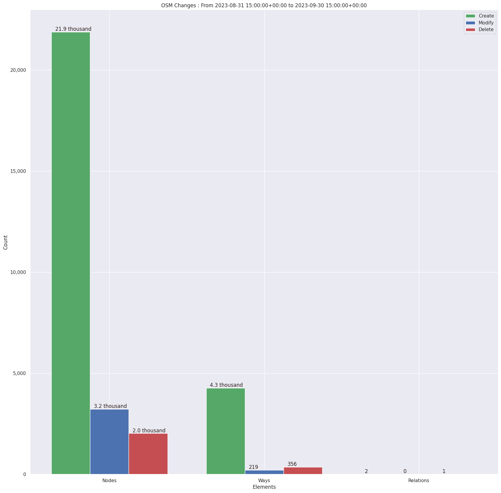
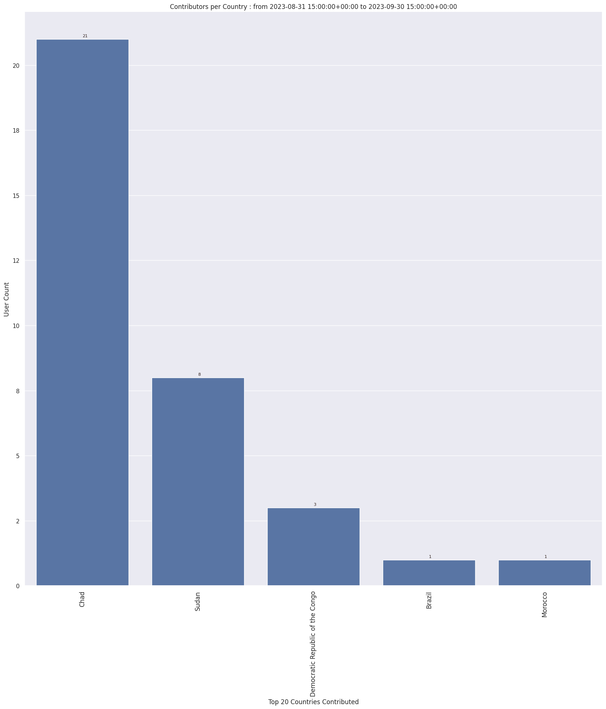
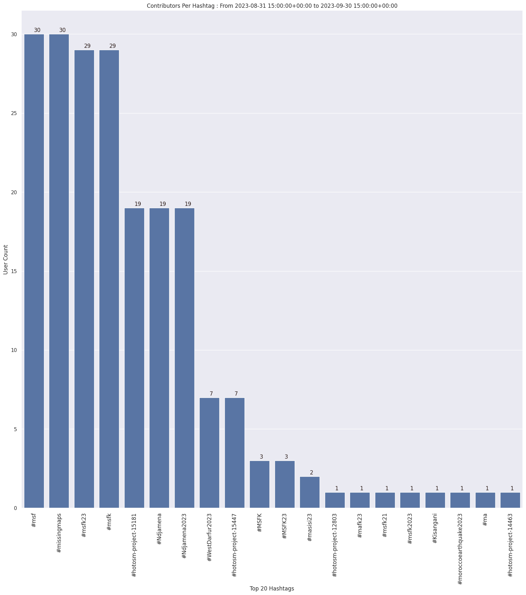
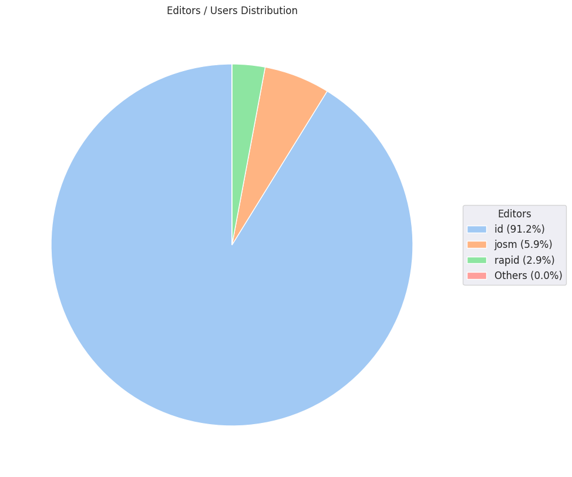

### Last Update : Stats from 2023-08-31 15:00:00+00:00 to 2023-09-30 15:00:00+00:00 (UTC Timezone)

#### 32 Users made 532 changesets with 32.0 thousand map changes.
#### 26.2 thousand OSM Elements were Created, 3.5 thousand Modified & 2.4 thousand Deleted.
Get Full Stats at [stats.csv](/msfk/2023/9/stats.csv)
 & Get Summary Stats at [stats_summary.csv](/msfk/2023/9/stats_summary.csv)

Top 5 Users are : 
- timeontheroad : 3.7 thousand Map Changes
- HEllieP : 3.0 thousand Map Changes
- LuxuryCoop : 3.0 thousand Map Changes
- hanB : 2.2 thousand Map Changes
- Palan Lee : 2.1 thousand Map Changes

Summary of Supplied Tags
- poi = Created: 0, Modified : 2
- building = Created: 4.3 thousand, Modified : 126
- highway = Created: 1, Modified : 62

Top 5 trending hashtags are:
- #msf : 30 users
- #missingmaps : 30 users
- #msfk : 29 users
- #msfk23 : 29 users
- #Ndjamena2023 : 19 users

Top 5 trending editors are:
- iD 2.21.1 : 31 users
- JOSM/1.5 (18789 ko) : 1 users
- JOSM/1.5 (18822 en) : 1 users
- RapiD 1.1.9-tm.1 : 1 users

Top 5 trending Countries where user contributed are:
- Chad : 21 users
- Sudan : 8 users
- Democratic Republic of the Congo : 3 users
- Morocco : 1 users
- Brazil : 1 users

 Charts : 
 
 
 
 
