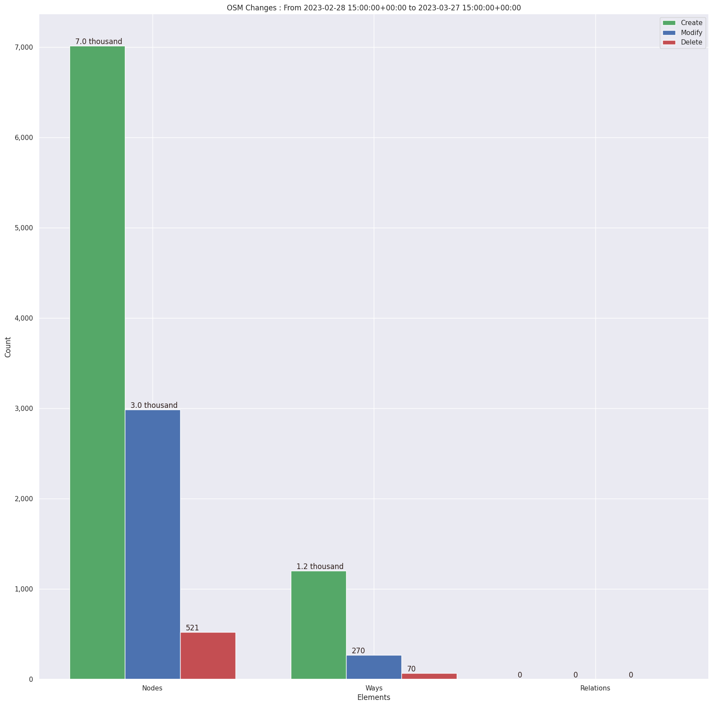
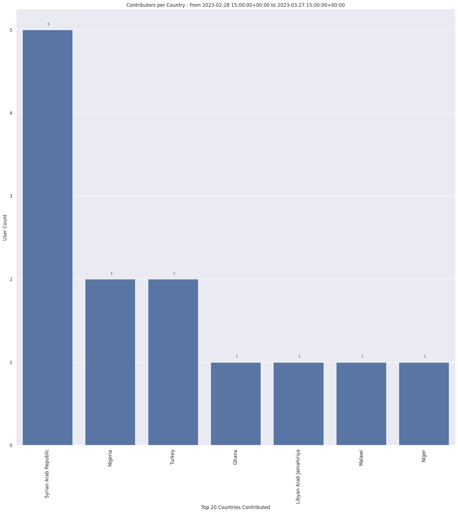
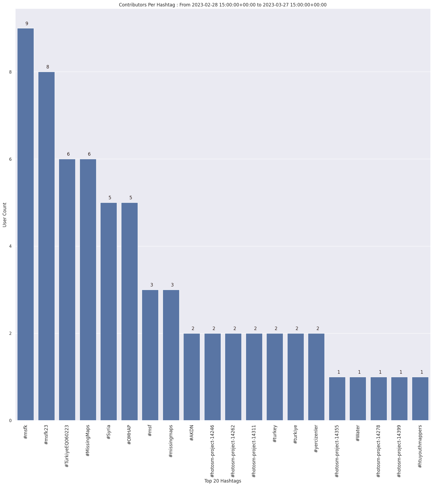
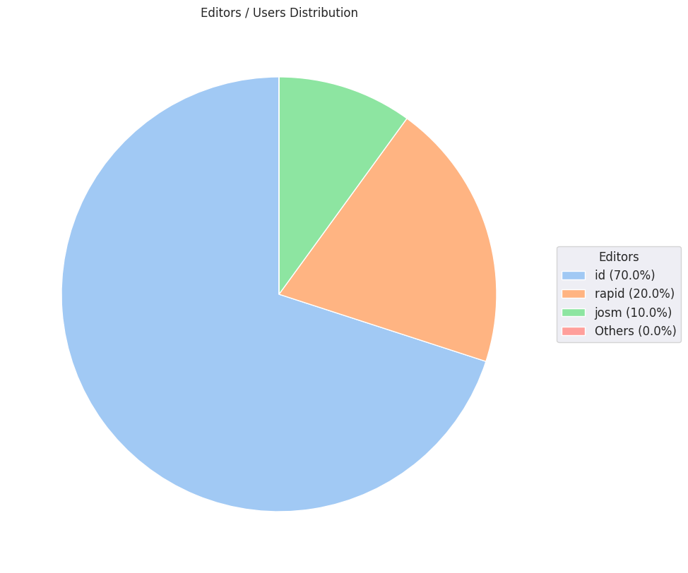

### Last Update : Stats from 2023-02-28 15:00:00+00:00 to 2023-03-31 15:00:00+00:00 (UTC Timezone)

#### 9 Users made 58 changesets with 12.1 thousand map changes.
#### 8.2 thousand OSM Elements were Created, 3.3 thousand Modified & 591 Deleted.
Get Full Stats at [stats.csv](/msfk/2023/3/stats.csv)
 & Get Summary Stats at [stats_summary.csv](/msfk/2023/3/stats_summary.csv)

Top 5 Users are : 
- Deuckchung : 5.2 thousand Map Changes
- Palan Lee : 1.8 thousand Map Changes
- upscope : 943 Map Changes
- jungyouth : 921 Map Changes
- Ireneeom : 897 Map Changes

Summary of Supplied Tags
- poi = Created: 0, Modified : 0
- building = Created: 1.1 thousand, Modified : 228
- highway = Created: 56, Modified : 32

Top 5 trending hashtags are:
- #msfk : 9 users
- #msfk23 : 8 users
- #TürkiyeEQ060223 : 6 users
- #MissingMaps : 6 users
- #OMHAP : 5 users

Top 5 trending editors are:
- iD 2.21.1 : 7 users
- RapiD 1.1.9-tm.1 : 2 users
- JOSM/1.5 (18678 en) : 1 users

Top 5 trending Countries where user contributed are:
- Syrian Arab Republic : 5 users
- Nigeria : 2 users
- Turkey : 2 users
- Niger : 1 users
- Ghana : 1 users

 Charts : 
 
 
 
 
