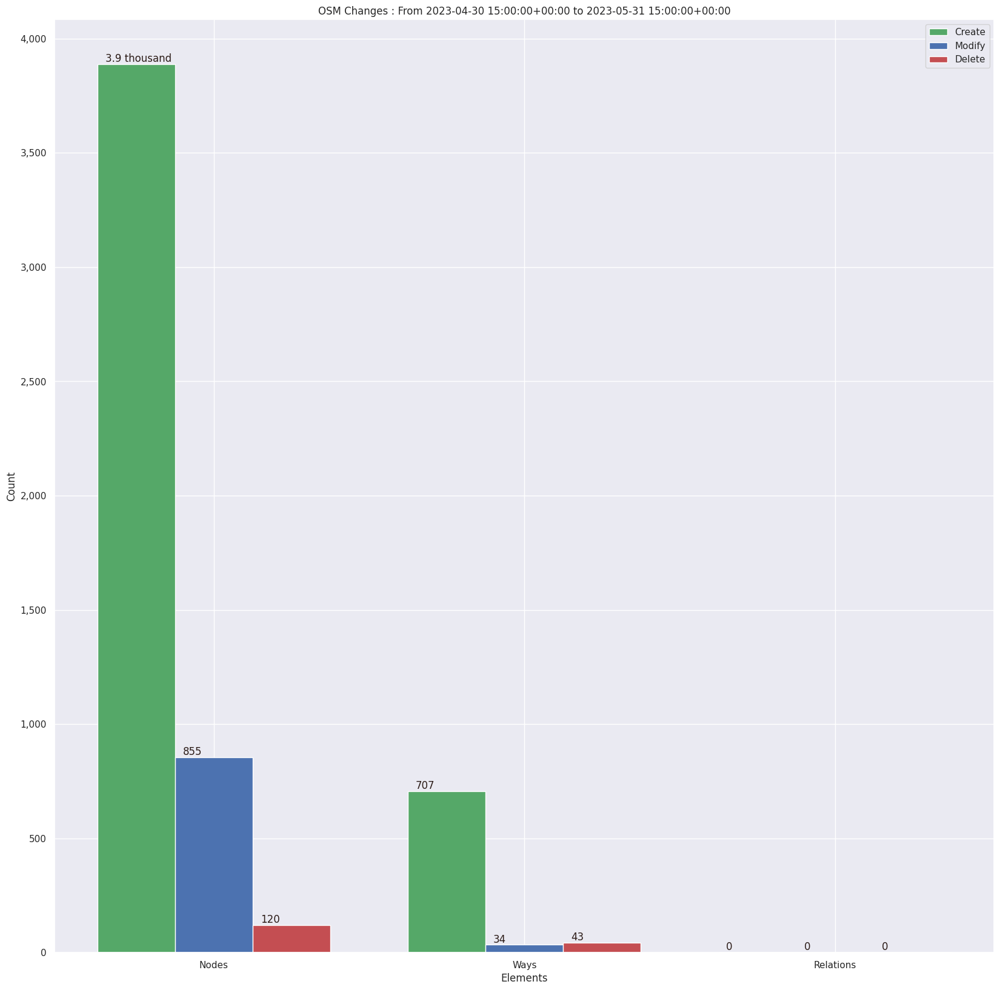
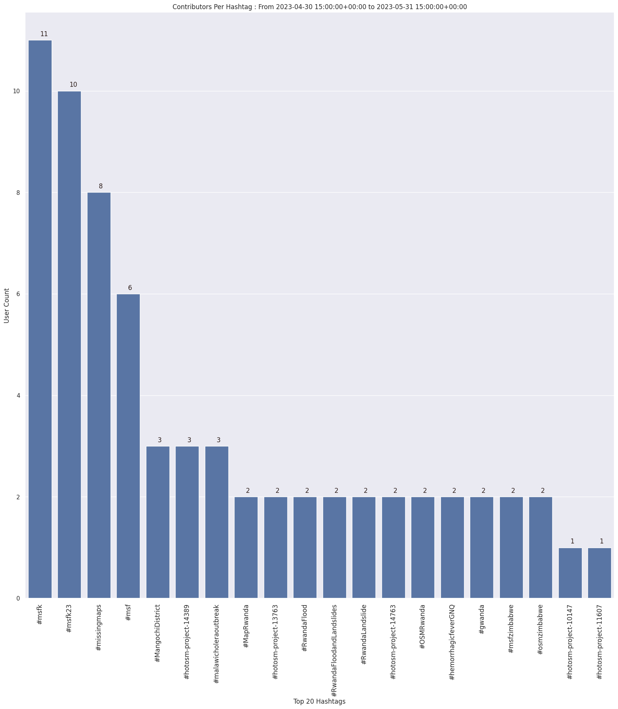
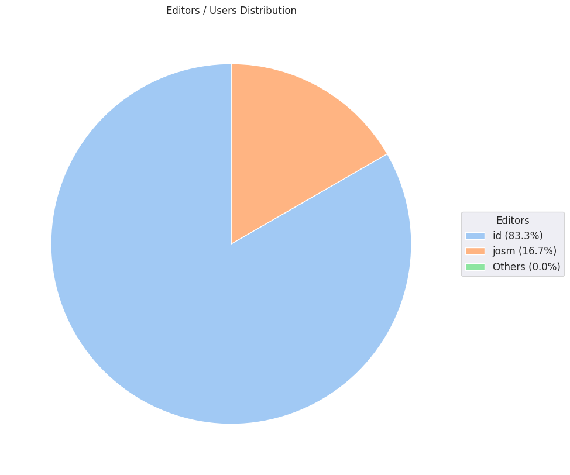

### Last Update : Stats from 2023-04-30 15:00:00+00:00 to 2023-05-31 15:00:00+00:00 (UTC Timezone)

#### 11 Users made 88 changesets with 5.6 thousand map changes.
#### 4.6 thousand OSM Elements were Created, 889 Modified & 163 Deleted.
Get Full Stats at [stats.csv](/msfk/2023/5/stats.csv)
 & Get Summary Stats at [stats_summary.csv](/msfk/2023/5/stats_summary.csv)

Top 5 Users are : 
- HyeinHong : 2.9 thousand Map Changes
- MarigoldC : 897 Map Changes
- Deuckchung : 541 Map Changes
- Doyeon Kim 12 : 458 Map Changes
- Ad Meliora : 389 Map Changes

Summary of Supplied Tags
- poi = Created: 0, Modified : 0
- building = Created: 690, Modified : 2
- highway = Created: 17, Modified : 29

Top 5 trending hashtags are:
- #msfk : 11 users
- #msfk23 : 10 users
- #missingmaps : 8 users
- #msf : 6 users
- #hotosm-project-14389 : 3 users

Top 5 trending editors are:
- iD 2.21.1 : 10 users
- JOSM/1.5 (18721 en) : 1 users
- JOSM/1.5 (18700 en) : 1 users

Top 5 trending Countries where user contributed are:
- Malawi : 3 users
- Equatorial Guinea : 2 users
- Zimbabwe : 2 users
- Rwanda : 2 users
- Gabon : 1 users

 Charts : 
 
 
 
 
