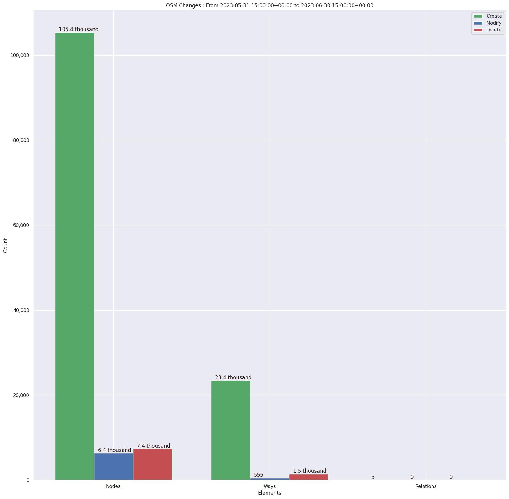
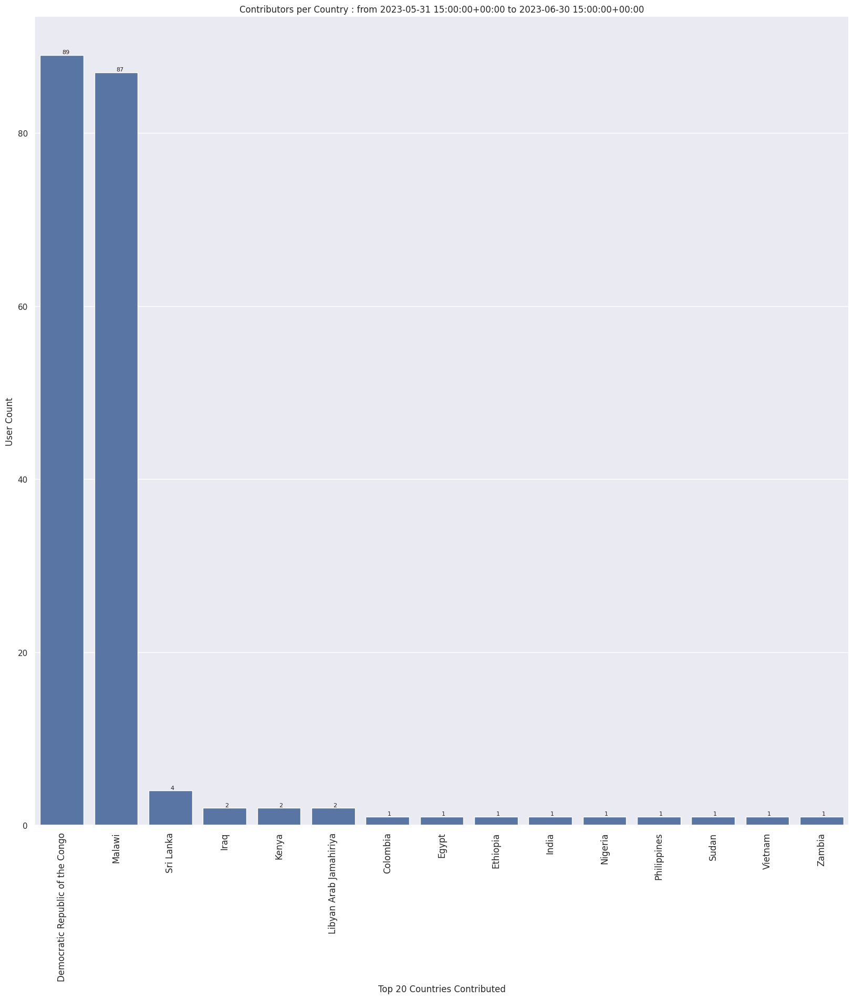
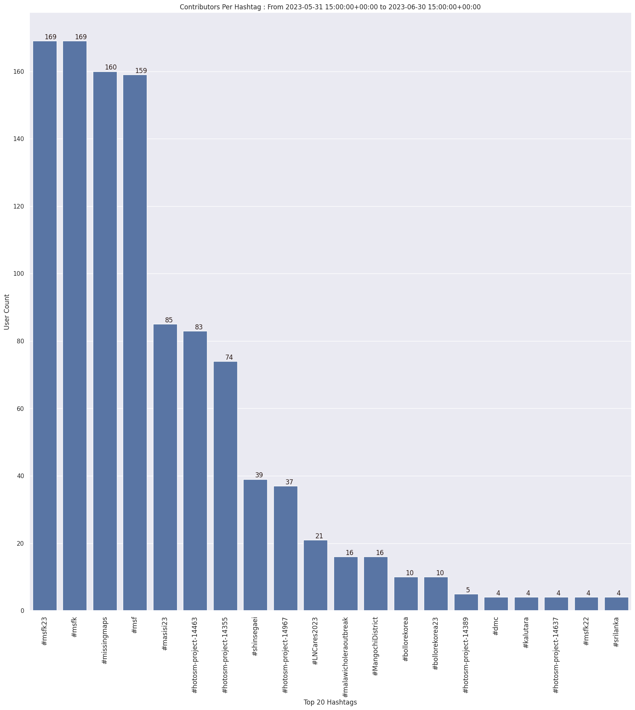
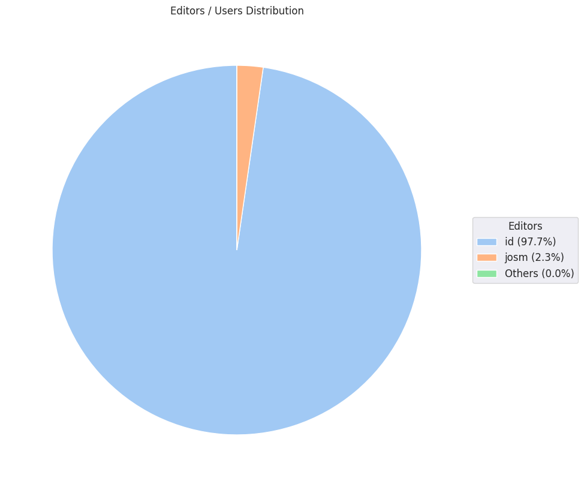

### Last Update : Stats from 2023-05-31 15:00:00+00:00 to 2023-06-30 15:00:00+00:00 (UTC Timezone)

#### 175 Users made 2.9 thousand changesets with 144.6 thousand map changes.
#### 128.8 thousand OSM Elements were Created, 6.9 thousand Modified & 8.8 thousand Deleted.
Get Full Stats at [stats.csv](/msfk/2023/6/stats.csv)
 & Get Summary Stats at [stats_summary.csv](/msfk/2023/6/stats_summary.csv)

Top 5 Users are : 
- 소쩍새라이더 : 18.9 thousand Map Changes
- qkrtldus : 17.6 thousand Map Changes
- LuxuryCoop : 4.1 thousand Map Changes
- gcbbcg : 3.1 thousand Map Changes
- 꾸르미 : 2.6 thousand Map Changes

Summary of Supplied Tags
- poi = Created: 0, Modified : 7
- building = Created: 23.3 thousand, Modified : 211
- highway = Created: 18, Modified : 185

Top 5 trending hashtags are:
- #msfk : 169 users
- #msfk23 : 169 users
- #missingmaps : 160 users
- #msf : 159 users
- #masisi23 : 85 users

Top 5 trending editors are:
- iD 2.21.1 : 171 users
- JOSM/1.5 (18746 en) : 2 users
- JOSM/1.5 (18746 ko) : 1 users
- JOSM/1.5 (18646 en) : 1 users

Top 5 trending Countries where user contributed are:
- Democratic Republic of the Congo : 89 users
- Malawi : 87 users
- Sri Lanka : 4 users
- Libyan Arab Jamahiriya : 2 users
- Iraq : 2 users

 Charts : 
 
 
 
 
