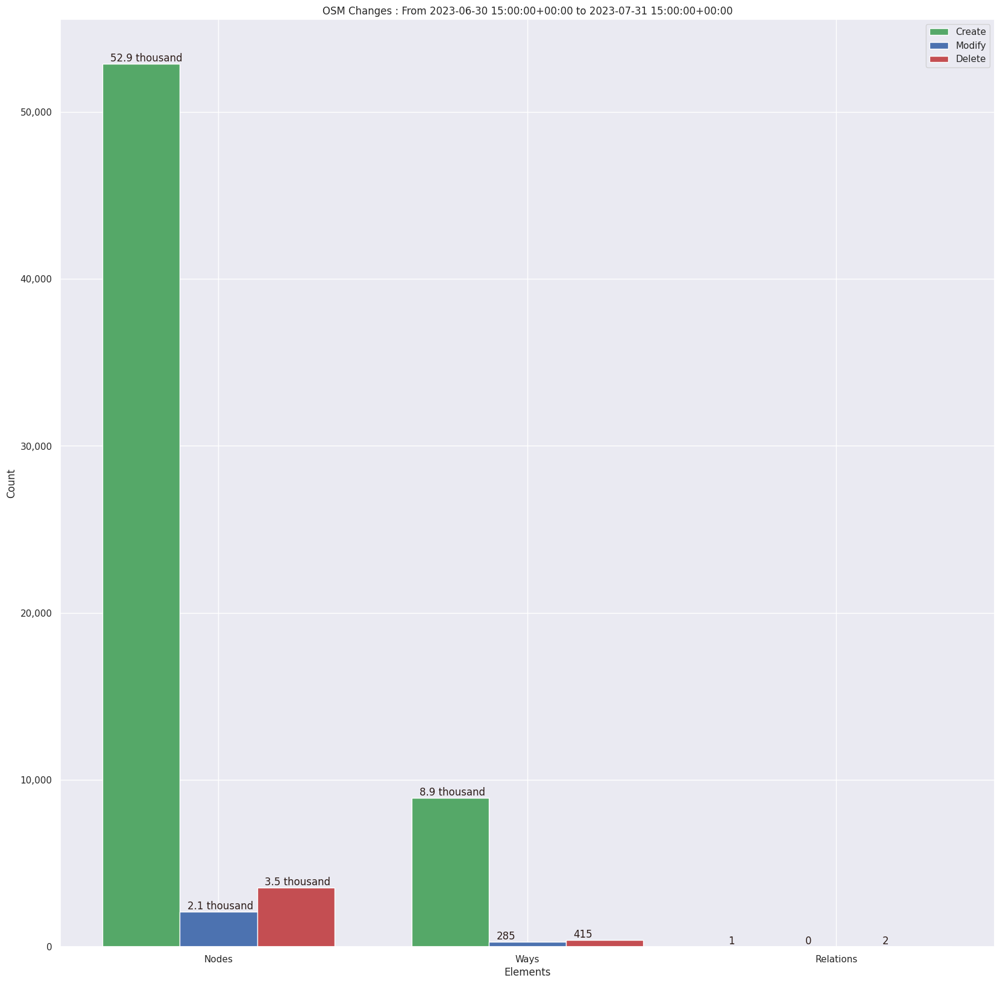
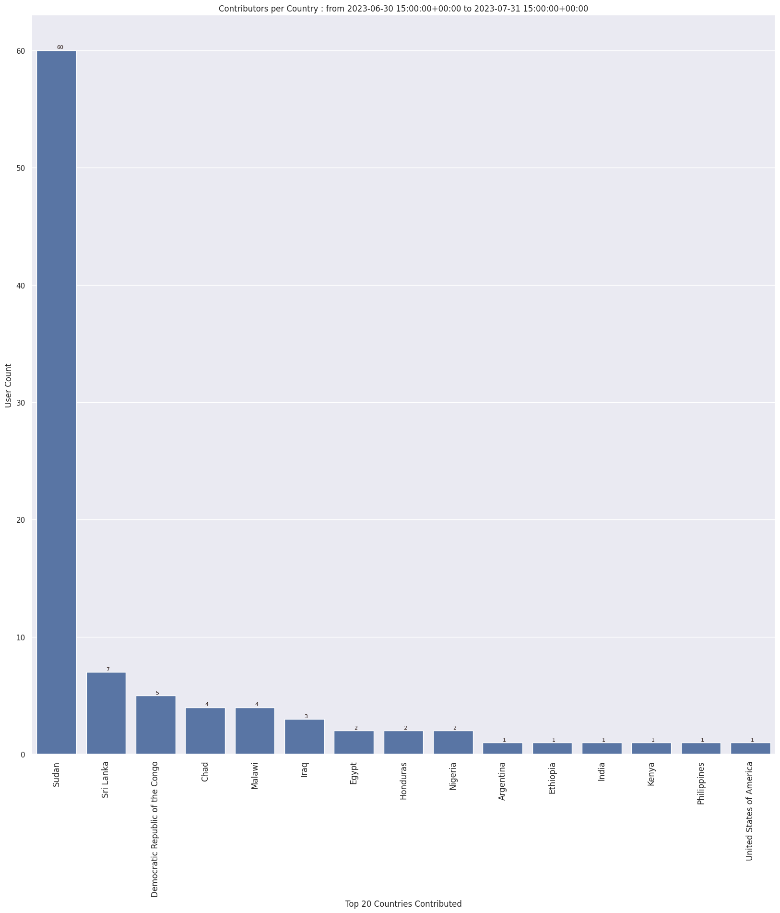
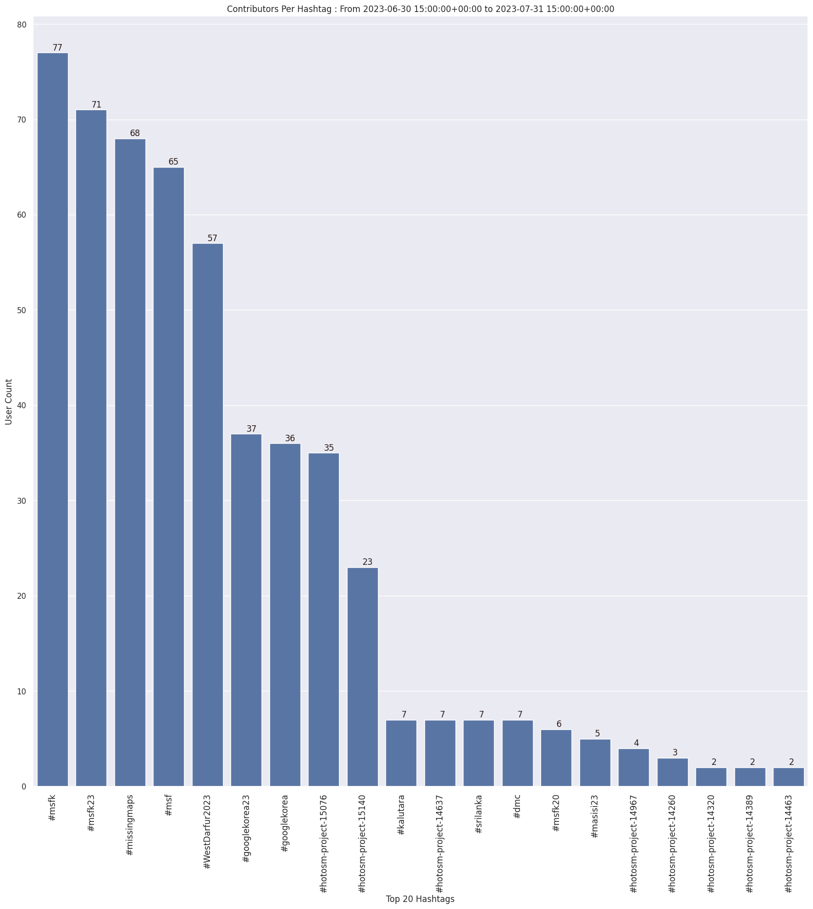
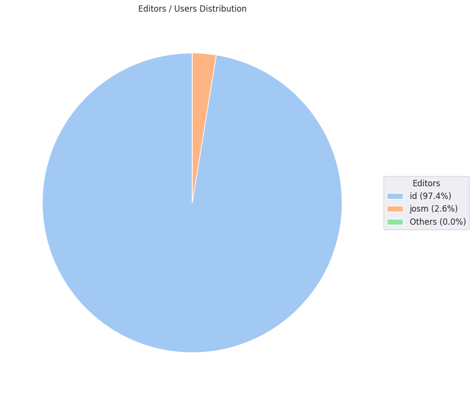

### Last Update : Stats from 2023-06-30 15:00:00+00:00 to 2023-07-31 15:00:00+00:00 (UTC Timezone)

#### 77 Users made 1.1 thousand changesets with 68.2 thousand map changes.
#### 61.8 thousand OSM Elements were Created, 2.4 thousand Modified & 4.0 thousand Deleted.
Get Full Stats at [stats.csv](/msfk/2023/7/stats.csv)
 & Get Summary Stats at [stats_summary.csv](/msfk/2023/7/stats_summary.csv)

Top 5 Users are : 
- Palan Lee : 10.7 thousand Map Changes
- 소쩍새라이더 : 6.2 thousand Map Changes
- timeontheroad : 4.8 thousand Map Changes
- Doyeon Kim 12 : 4.7 thousand Map Changes
- kimjuhyun : 3.2 thousand Map Changes

Summary of Supplied Tags
- poi = Created: 0, Modified : 10
- building = Created: 8.9 thousand, Modified : 110
- highway = Created: 27, Modified : 115

Top 5 trending hashtags are:
- #msfk : 77 users
- #msfk23 : 71 users
- #missingmaps : 68 users
- #msf : 65 users
- #WestDarfur2023 : 57 users

Top 5 trending editors are:
- iD 2.21.1 : 76 users
- JOSM/1.5 (18772 en) : 1 users
- JOSM/1.5 (18746 en) : 1 users

Top 5 trending Countries where user contributed are:
- Sudan : 60 users
- Sri Lanka : 7 users
- Democratic Republic of the Congo : 5 users
- Chad : 4 users
- Malawi : 4 users

 Charts : 
 
 
 
 
