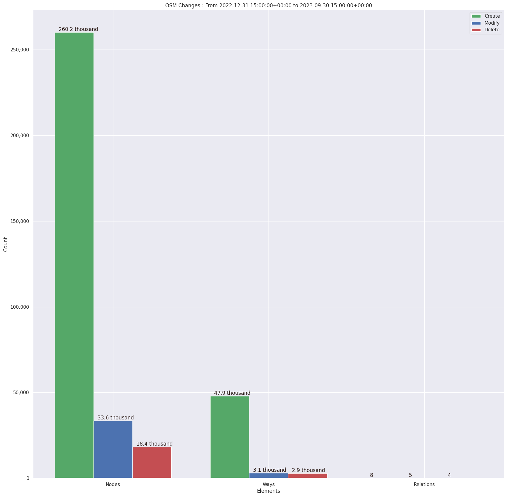
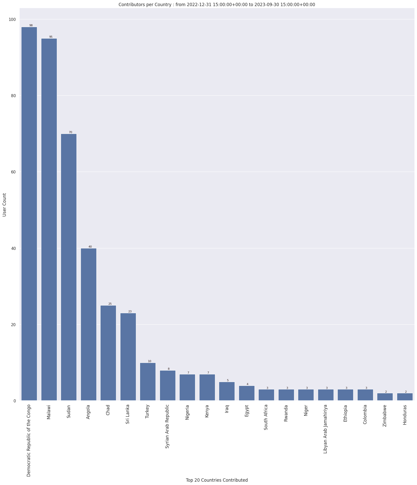
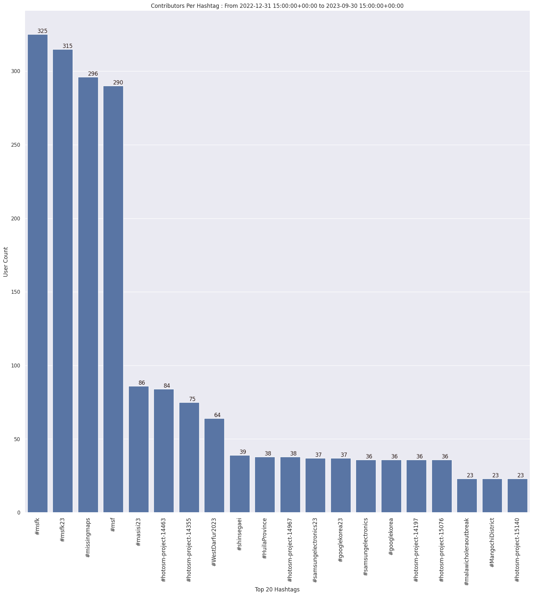
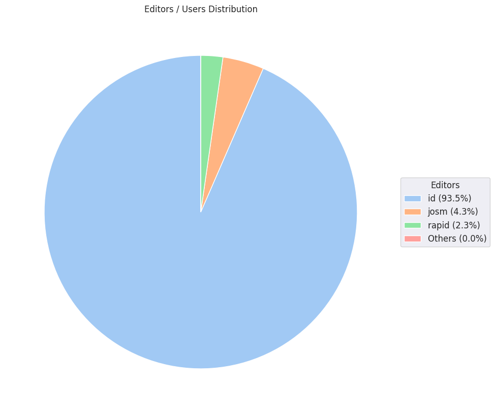

### Last Update : Stats from 2022-12-31 15:00:00+00:00 to 2023-10-18 15:00:00+00:00 (UTC Timezone)

#### 335 Users made 5.4 thousand changesets with 366.2 thousand map changes.
#### 308.1 thousand OSM Elements were Created, 36.8 thousand Modified & 21.3 thousand Deleted.
Get Full Stats at [stats.csv](/msfk/2023/all/stats.csv)
 & Get Summary Stats at [stats_summary.csv](/msfk/2023/all/stats_summary.csv)

Top 5 Users are : 
- 소쩍새라이더 : 25.1 thousand Map Changes
- LuxuryCoop : 22.1 thousand Map Changes
- Deuckchung : 20.5 thousand Map Changes
- Palan Lee : 20.3 thousand Map Changes
- qkrtldus : 19.1 thousand Map Changes

Summary of Supplied Tags
- poi = Created: 6, Modified : 59
- building = Created: 46.8 thousand, Modified : 1.7 thousand
- highway = Created: 782, Modified : 1.1 thousand

Top 5 trending hashtags are:
- #msfk : 325 users
- #msfk23 : 315 users
- #missingmaps : 296 users
- #msf : 290 users
- #masisi23 : 86 users

Top 5 trending editors are:
- iD 2.21.1 : 329 users
- RapiD 1.1.9-tm.1 : 8 users
- JOSM/1.5 (18646 en) : 2 users
- JOSM/1.5 (18746 en) : 2 users
- JOSM/1.5 (18789 ko) : 1 users

Top 5 trending Countries where user contributed are:
- Democratic Republic of the Congo : 98 users
- Malawi : 95 users
- Sudan : 70 users
- Angola : 40 users
- Chad : 25 users

 Charts : 
 
 
 
 
